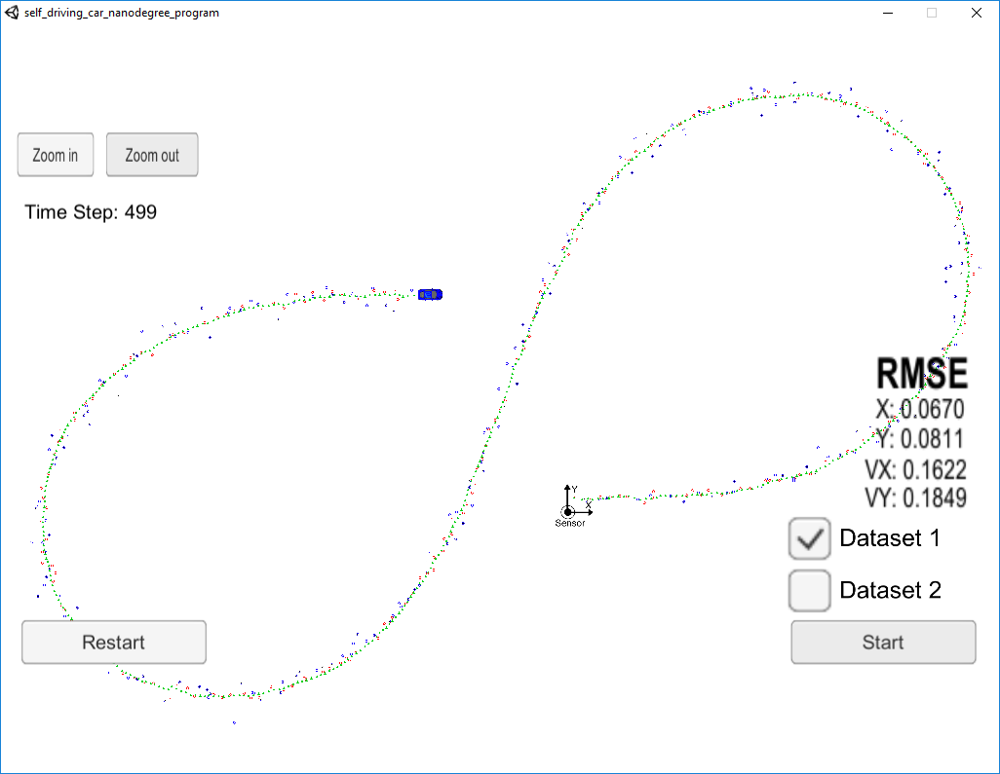
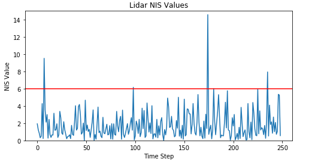
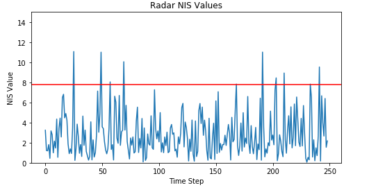

# CarND-Unscented-Kalman-Filter-P2
Udacity Self-Driving Car Nanodegree - Unscented Kalman Filter Implementation

# Overview
This project consists of implementing an [Unscented Kalman Filter](https://en.wikipedia.org/wiki/Kalman_filter#Unscented_Kalman_filter) with C++. A simulator provided by Udacity generates noisy RADAR and LIDAR measurements of the position and velocity of an object, and the Unscented Kalman Filter[UKF] must fusion those measurements to predict the position of the object. The communication between the simulator and the UKF is done using [WebSocket](https://en.wikipedia.org/wiki/WebSocket) using the [uWebSockets](https://github.com/uNetworking/uWebSockets) implementation.


# Prerequisites

The project has the following dependencies (from Udacity's seed project):

- cmake >= 3.5
- make >= 4.1
- gcc/g++ >= 5.4
- Udacity's simulator.


# Compiling and executing the project

These are the suggested steps:

- Clone the repo and cd to it on a Terminal.
- Create the build directory: `mkdir build`
- `cd build`
- `cmake ..`
- `make`: This will create the following executable
  - `UnscentedKF` : UKF implementation.

## Running the Filter

From the build directory, execute `./UnscentedKF`. The output should be:

```
Listening to port 4567
Connected!!!
```

The simulator connect to it right away.

The simulator provides two datasets. The difference between them are:

- The direction the car (the object) is moving.
- The order the first measurement is sent to the EKF. On dataset 1, the LIDAR measurement is sent first. On the dataset 2, the RADAR measurement is sent first.

Here is the simulator final state after running the UKF with dataset 1:



Here is the simulator final state after running the UKF with dataset 2:


# Process noise selection

Part of this project was choosing the hardcoded variance of the random linear and yaw rate accelerations applied during the predict step. The chosen values should be physically reasonable for a bicycle. I have chosen , 

    std_a = 1
    std_yaw = 0.5

# Initialization of 'x' vector 

Initialization of x vector is another critical step. For Laser we do get the x and y location but we dont get any velocity information. I just Googled for average bicycle speed and it is like 15.5 km/h. After converting to m/s I get the average spped as 4 m/s. So, I have set initial velocity as 4. I assumed that the bicycle is moving straigth and set yaw and yaw rate both as 0.

For, radar although we get a velocity information but we can't use it directly as this velocity is with respect to the sensor. If the actual object velocity is v and radar detected rho_dot. Then we can say,
 
     v cos (psi) cos (phi) = rho_dot
 
 I assumed psi is 0 i.e, the bicycle is moving straigth so,
 
     v = rho_dot / cos (phi) 
    
This step can be found at [src/ukf.cpp](./src/ukf.cpp#L152)

# NIS values (Normalized Innovation Squared)

One of the methods employed for testing accuracy and consistency was to use NIS (Normalized Innovation Squared). To calculate NIS, this method first measures the innovation, which is the difference between the estimated positions and the ground truth value. This difference is then normalized by the inverse of the vector S. NIS says that in a 3 dimentional space, approximately 5% of the NIS values should be over 7.82 (and with 2 dimentional space 5.99) with a proper implementation of your algorithm. This seems to hold about true when looking at the charts for lidar and radar NIS values:





# [Rubric](https://review.udacity.com/#!/rubrics/783/view) points

## Compiling

### Your code should compile

The code compiles without errors. 

## Accuracy

### px, py, vx, vy output coordinates must have an RMSE <= [.09, .10, 0.40, 0.30] when using the file: "obj_pose-laser-radar-synthetic-input.txt which is the same data file the simulator uses for Dataset 1"

The UKF accuracy was:

- Dataset 1 : RMSE <= [0.0670, 0.0811, 0.1622, 0.1849]
- Dataset 2 : RMSE <= [0.0654, 0.0641, 0.1504, 0.1674]

The RMSE values that I got in previous project using Extended Kalman Filter on the same dataset are:

- Dataset 1 : RMSE <= [0.0964, 0.0853, 0.4154, 0.4316]
- Dataset 2 : RMSE <= [0.0726, 0.0965, 0.4216, 0.4932]

Clearly the UKF RMSE numbers are far better than the EKF results.

The UKF can be modified to use either RADAR or LIDAR data also. To do that we have to set either use_laser_ or use_radar_ variables to false in [src/ukf.cpp](./src/ukf.cpp#L38)

The UKF accuracy with only LIDAR data was:

- Dataset 1 : RMSE <= [0.1622, 0.1470, 0.2268, 0.2510]

The UKF accuracy with only RADAR data was:

- Dataset 1 : RMSE <= [0.2051, 0.2527, 0.3074, 0.2290]

## Following the Correct Algorithm

### Your Sensor Fusion algorithm follows the general processing flow as taught in the preceding lessons.

The Unscented Kalman filter implementation can be found in [src/ukf.cpp](./src/ukf.cpp) and it is used to predict at [UKF::Prediction API](./src/ukf.cpp#L204) and update happens using two different APIs - one for Laser [UKF::UpdateLidar API](./src/ukf.cpp#L311) and another for Radar [UKF::UpdateRadar API](./src/ukf.cpp#L401).

### Your Kalman Filter algorithm handles the first measurements appropriately.

The first measurement is handled at [src/ukf.cpp](./src/ukf.cpp#L134) from line 134 to line 184.

### Your Kalman Filter algorithm first predicts then updates.

The algorithm first predict upon receiving a measurement and then update the prediction using new measurement. The main processing steps are controlled in [UKF::ProcessMeasurement API](./src/ukf.cpp#L118).

### Your Kalman Filter can handle radar and lidar measurements.

Different type of measurements are handled in two places in [src/ukf.cpp](./src/ukf.cpp):

